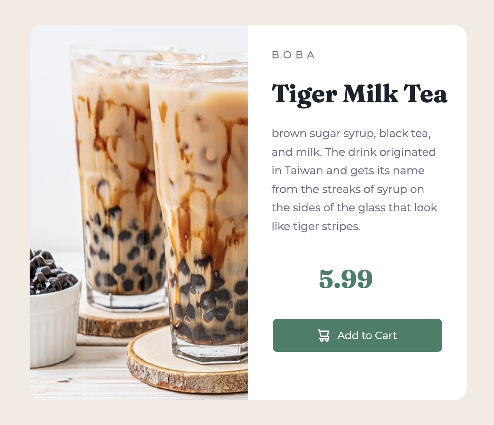

# Product-Card

## Table of contents

- [Overview](#overview)
  - [The challenge](#the-challenge)
  - [Screenshot](#screenshot)
  - [Links](#links)
  - [Built with](#built-with)

## Overview

### Introduction

Created a project on building a webpage workign with HTML, CSS and JS.

### The challenge

Users should be able to:

- View the optimal layout depending on their device's screen size
- See hover and focus states for interactive elements

### Screenshot

### Links

- Live Site URL: (https://tranr5.github.io/Product-Card/))

### Built with

- Semantic HTML5 markup
- CSS custom properties
- Flexbox
